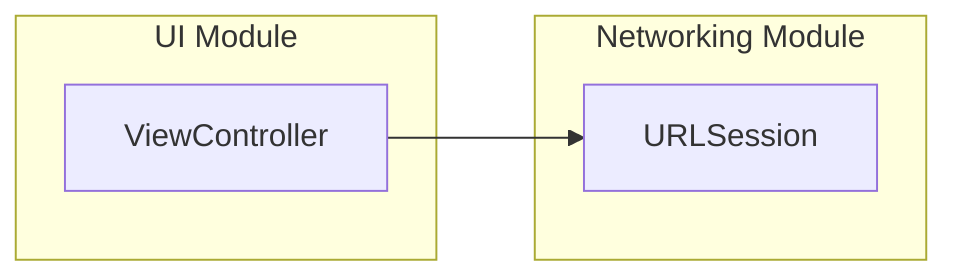
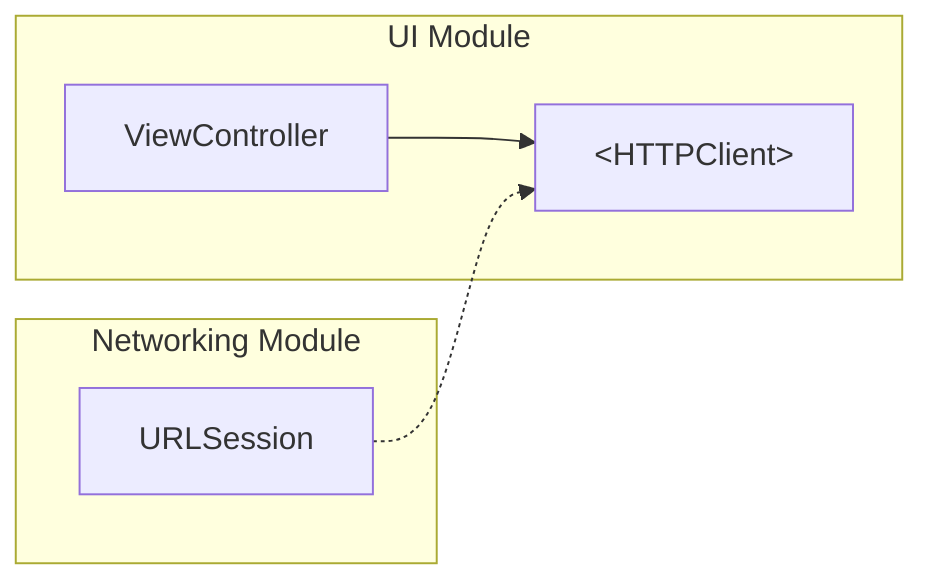
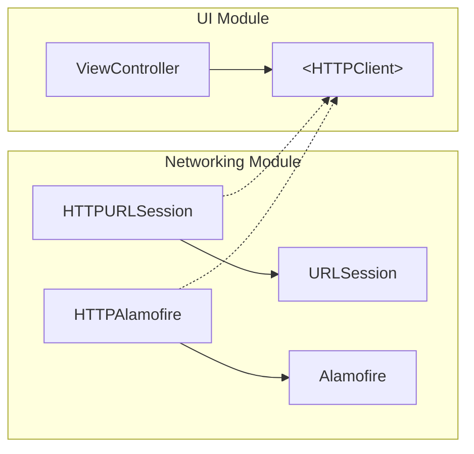

The Dependency Inversion Principle is the last one from [SOLID](https://en.wikipedia.org/wiki/SOLID) stands for decoupling the system into independent modules. It means that one part of a system should not depend on another one directly.

Let's see an example.

<!-- truncate -->

On the one hand, we have a `ViewController` which is the part of _UI/Presentation Module_, and on the other hand, we have some data source which can be a part of _Networking/Persistence Module_. Let's say it is an `URLSession` object.

```swift
class ViewController: UIViewController {

    override func viewDidLoad() {
        super.viewDidLoad()

        URLSession.shared.dataTask(with: url) { data, response, error in
            // Do something with response
        }.resume()
    }

}
```

<br/>

This code can be represented by a diagram

<div style={{textAlign: 'center'}}>



</div>

The `UIViewController` depends on `URLSession` concrete implementation. And it means that `URLSession` **can't** be replaced with another _Network_ client such as [Alamofire](https://github.com/Alamofire/Alamofire) without changing the _Presentation Module_.

## Solution

This problem can be solved with Dependency Inversion just by adding another abstraction between concrete implementations. Some `protocol` that can live in _Presentation Module_ and the _Network Module_ can conform to it.

<div style={{textAlign: 'center'}}>



</div>

and the code above will transform to

```swift
protocol HTTPClient {
    func load(url: URL, completion: @escaping (Data?, URLResponse?, Error?) -> Void)
}

class ViewController: UIViewController {

    var client: HTTPClient!

    override func viewDidLoad() {
        super.viewDidLoad()

        client.load(url: url) { (data, response, error) in
            // Do something
        }
    }
}
```

Now you can have two separate implementations of `HTTPClient` protocol, and they both can live in _Network Module_

<div style={{textAlign: 'center'}}>



</div>

That's the way you invert the dependencies from one module to another, and now you can easily switch between two concrete implementations of `HTTPClient` from _Networking Module_.

<!-- so the protocol conformance can be achieved via extension:

```swift
extension URLSession: HTTPClient {
    func load(url: URL, completion: @escaping  (Data?, URLResponse?, Error?) -> Void) {
        dataTask(with: url, completionHandler: completion).resume()
    }
}
```

or just by inheritance:

```swift
class HTTPURLSession: URLSession, HTTPClient {
    func load(url: URL, completion: @escaping (Data?, URLResponse?, Error?) -> Void) {
        dataTask(with: url, completionHandler: completion)
    }
}
```
The second way is preferred cause it excludes any conflicts with future `URLSession` methods which can be introduced by Apple. -->
