Ngrok is a popular tool for web developers that lets you create secure tunnels from the public internet to local servers running on a developer's machine. However, it may not be available with certain providers.

<!-- truncate -->

```bash
$ ngrok http 3000
ERROR:  authentication failed: We do not allow agents to connect to ngrok from your IP address (188.146.58.201).
ERROR:
ERROR:  ERR_NGROK_9040
ERROR:  https://ngrok.com/docs/errors/err_ngrok_9040
ERROR:
```

Luckily, there is an open-source alternative called [sish](https://github.com/antoniomika/sish). It can be deployed on your personal web server, and here is a step-by-step tutorial on how to do it.

Let’s start with the minimal infrastructure you’ll need.

## Infrastructure configuration

```mermaid
architecture-beta
    group cloud(cloud)[Cloud provider]
    
    service server(server)[Server] in cloud
    service laptop(user)[Laptop]
    service inet(internet)[User from external network]
    
    laptop:R <--> L:server
    inet:L --> R:server
```



### Step I. Configure the remote server

The easiest way to deploy sish is with [docker compose](https://docs.docker.com/compose/).

Create `compose.yml` file:

```yaml title="/opt/sish/compose.yml"
services:
  sish:
    image: antoniomika/sish:latest
    container_name: sish
    volumes:
      - ./keys:/keys
    ports:
      - 2222:22
    command: |
      --ssh-address=:22
      --http-address=:80
      --bind-random-ports=false
      --bind-random-subdomains=false
      --domain=example.com
      --authentication-keys-directory=/keys
      --private-keys-directory=/keys
    restart: unless-stopped
```

Replace `--domain=example.com` with a domain you own.

Create `keys` directory:

```bash
mkdir -p /opt/sish/keys
```

### Step II. Add your public key

Since sish uses SSH, you’ll need to copy your public key to the server:

```bash
scp ~/.ssh/id_rsa.pub example.com:/opt/sish/keys/
```

:::info

Instead of RSA, use a **Ed25519** - it's faster and considered [more secure](https://security.stackexchange.com/a/90083) in most cases.

:::

### Step III. Run sish and open a tunnel

On the **remote host**, start the service:

```bash
docker-compose -f /opt/sish/compose.yml up -d
```

On your **local machine**, run your web app (say, on port 3000) and start a tunnel:

```bash
ssh -p 2222 -R dev:80:localhost:3000 example.com
```

If it worked, you’ll see:

```bash
Press Ctrl-C to close the session.

Starting SSH Forwarding service for http:80. Forwarded connections can be accessed via the following methods:
HTTP: http://dev.example.com
```

Now open `dev.example.com` in your browser - and you're all set!

### Bonus: WebSocket support

To keep WebSocket connections from reconnecting every few seconds, add this line:

```yaml title="/opt/sish/compose.yml"
services:
  sish:
    image: antoniomika/sish:latest
    container_name: sish
    volumes:
      - ./keys:/keys
    ports:
      - 2222:22
    command: |
      --ssh-address=:22
      --http-address=:80
      --bind-random-ports=false
      --bind-random-subdomains=false
      --domain=example.com
      --authentication-keys-directory=/keys
      --private-keys-directory=/keys
      // highlight-next-line
      --idle-connection=false
    restart: unless-stopped
```

👉 That’s it — you’ve got your own self-hosted ngrok alternative running!